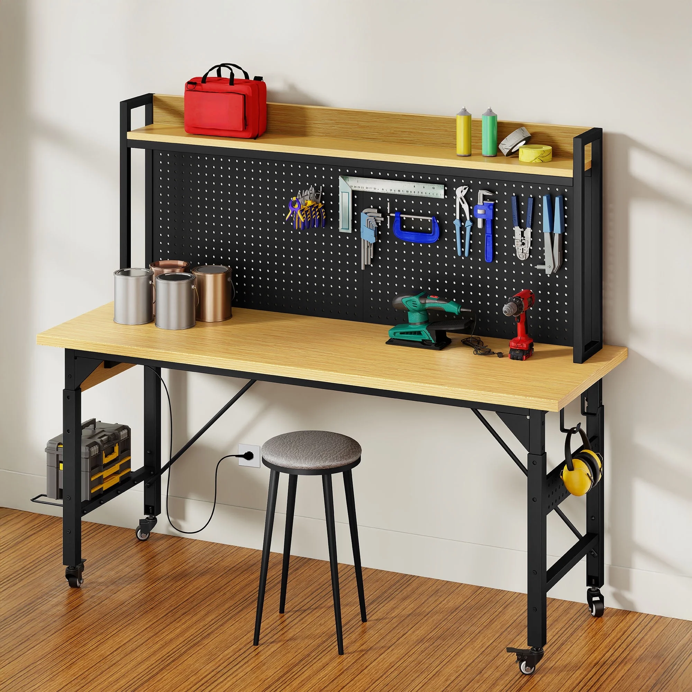

# Frankie's Corner

A corner of the study turned into a clean, flexible workbench for nerdy fun: electronics, Arduino, Raspberry Pi, LEGO / K'NEX / puzzles, any kind of crafting or building project, and making music. Not a traditional computer desk. The surface stays clear and open at all times. The monitor lives off the surface (wall or floating mount), and parts and tools get their own storage.

## What I'm actually trying to build

I struggled to find this online because I didn't know what to call it. The closest real-world terms are: **electronics workbench**, **maker desk**, **IT / LAN workstation**, **tech workstation**, or **computer workbench**. Everything I found that nailed all my requirements was either aimed at businesses or absurdly expensive (one custom worktable was over $5,000). Building it from scratch isn't an option (I don't know how, and I need to get something soon because that corner is sad). So the goal is to **assemble** the right setup from cheap, off-the-shelf parts rather than build or buy a single fancy unit.

## The space

- Corner wall is **75"** wide on paper.
- But when the **closet door swings open** the usable width drops to about **60"**.
- The futon that used to be here is gone, so I have more room than the old plan assumed (the old doc capped me at 47").
- **Working constraint: the desk must clear the closet door. Aim for ~48", up to ~55" max** if the door still opens freely. Don't fill the whole 60".

## Requirements

Must have:

- Completely clean, open work surface (nothing permanently on it, no PC sitting on top)
- Correct height to sit at with a normal desk chair (fixed sit-down height; no standing desk needed)
- Room for legs underneath
- Monitor that is **wall-mounted or floating**, NOT sitting on the surface
- Storage for small parts / pieces
- A place to keep tools
- Power strip or outlets, ideally across the back

Nice to have:

- Lighting above the work surface
- Room underneath for a PC or storage (on a shelf or the floor, not on the desktop)

## How the plan is organized

Three separate tiers, in the order they matter. You don't have to decide a later tier to act on an earlier one.

1. **The Surface** - the table itself. The main thing, and the only decision to make right now.
2. **The Add-ons** - what bolts onto the desk or the wall: monitor, storage, power, light.
3. **The Gear** - what lives on the finished workbench later: mini PC, Raspberry Pi, MIDI keyboard, speakers, software.

The trick is to stop looking for one perfect product. Buy a plain surface now, then add everything else over time as cheap, independent upgrades. Nothing below requires rebuilding anything above it.

---

## Tier 1 - The Surface (buy this now)

This is the only thing to order right now. **A simple, fixed-height rectangular desk, about 48" wide** (up to ~55" only if the closet door still clears it), with an open top and room for legs underneath. **About 24-30" deep** so a wall-mounted monitor sits at a comfortable distance and there's room for projects in front. **No hutch, no back panel, no built-in shelves, no pegboard** so it pushes flat against the wall and leaves the wall free for the optional storage later.

Plain table-style desks like this run roughly **$80-150** at Amazon, Home Depot, Wayfair, or IKEA. That's the whole Tier 1 decision. Everything below gets added to this desk afterward.

---

## Tier 2 - The Add-ons (bolt onto the desk or wall, whenever)

### Monitor (off the surface)

A single monitor that mounts to the wall behind the desk (a **VESA wall mount**) or a clamp-on **monitor arm** that grabs the back edge of the desk. Either one frees up the entire surface. Wall mount is cheapest and keeps the desk totally clear; an arm is easier to reposition. ~$25-60. One monitor is enough, since it'll switch between music, coding, and project output.

> **What's VESA?** VESA stands for the **Video Electronics Standards Association** (say it "VEE-suh"). In practice it just means a standard square pattern of four screw holes on the back of a monitor, usually 75x75mm or 100x100mm. Any mount built to that same pattern fits any screen built to it, so monitors, wall mounts, and arms all bolt together predictably. It also matters later: many mini PCs include a small VESA bracket, so the computer can mount onto the back of the monitor and disappear (see Tier 3).

### Storage for tools and parts

Baseline (gets the job done):

- A small **rolling drawer cart** that tucks under or beside the desk for tools. ~$40-80.
- **Stackable small-parts bins / organizers** for components, LEGO, K'NEX, etc. ~$15-40.

**Luxury upgrade - wall storage (optional, not required):** Mount a **pegboard or slat panel on the wall behind the desk** and hang tools and small bins right off it, so I can grab whatever I need at eye level without reaching under the desk, like a real workbench. This is the look from the reference photos below, achieved cheaply by using the actual wall as the frame instead of buying an integrated unit. Pegboard panel + hooks + clip-on bins run roughly ~$40-100. Pure nicety; the baseline above covers everything functionally.

### Power and light

- A **power strip mounted to the back** of the desk (mounting tape or screws) so cords stay off the surface. ~$15-25.
- A **clamp-on LED light** or under-shelf light bar above the work area. ~$20-40.

---

## Tier 3 - The Gear (lives on the finished workbench, bought last)

None of this is part of the desk. It's what goes on top once the surface and add-ons exist. Listed here only to confirm it all fits the design (it does, and it keeps the surface clean).

### The computer: a mini PC

A **mini PC** (the small-form-factor kind you can hold in your hand, sometimes branded as a NUC) instead of a tower. It saves space, runs silent, and most have **VESA holes** so it mounts to the back of the monitor and vanishes. This also replaces the old "room for a PC tower underneath" idea, freeing up that space. Spec a modern one with a **recent CPU, 16GB+ RAM, and an SSD** and it handles music production fine.

### Music: FL Studio (needs Windows)

FL Studio is the goal. Important: **FL Studio runs on Windows and Mac only. It does not run on Linux or on a Raspberry Pi.** So the mini PC should run **Windows**, which doubles as the everyday machine for coding too (Windows includes WSL, a real Linux environment underneath, so nothing is lost on the programming side).

### Combining the hobbies

Keep two brains rather than forcing one:

- **Windows mini PC** = music (FL Studio) + general use + coding (via WSL).
- **Raspberry Pi** = the dedicated board for electronics/Arduino tinkering at the bench.

This covers both passions without dual-booting friction, and the single monitor switches between them. (Linux and the Pi are a later experiment, not needed to get started.)

### Music peripherals

- **MIDI keyboard / controller:** a slim 25 or 49-key. Set it on the clear surface when playing, store it off the desk when not (wall hook, lean it, or a shelf), same grab-it-when-you-need-it logic as the tools. Probably no pull-out keyboard tray: it eats leg room, adds under-desk bulk, and most controllers are too deep for it anyway.
- **Computer keyboard + mouse:** wireless, stashed in the cart drawer or on a wall shelf between sessions.
- **Speakers:** small **studio monitors** (sold in pairs) on little stands, wall brackets, or a shelf, so they stay off the work surface and out of the way.
- **Audio interface (later, optional):** a small USB audio interface gives better sound and lower latency for recording. A "buy it when setting up the music software" decision, not a desk decision.

---

## Leading candidate - ModFusion 63" Metal Workbench

**[ModFusion 63" Metal Workbench with Pegboard, Hooks & Power Strip, Wood Top](https://www.walmart.com/ip/ModFusion-Black-Metal-Workbench-with-Pegboard-Hooks-Power-Strip-Natural-Wood-Finish/17304212934)** - $420.88 at Walmart. Free shipping, free 30-day returns. Sold/shipped by ModFusion (seller rated 4.2 stars over 774 reviews; the item itself has no ratings yet).

This is essentially the affordable version of the IT/LAN workbench look. It collapses Tier 1 plus most of Tier 2 into one purchase.

**What it includes (from the listing):** wood-grain MDF top **47.2"W x 23.6"D**, full-height pegboard back panel with **18 steel hooks** in three sizes (5/10/20 cm), an upper side shelf, a side organizer + hook, and a built-in **power strip (two AC + two USB, 6.56 ft cord)**. Black powder-coated steel frame, 76 lb, with a **500 lb load capacity**. Materials are steel (frame), MDF (top and shelf), and plastic (casters). Listed as **height-adjustable**, with **fixed feet or optional lockable caster wheels** (two with brakes). Overall height 63" including the pegboard.

**Pros:**

- Width **47.2"** lands right in the target zone and clears the closet door.
- **Pegboard + 18 hooks built in** - the wall-storage luxury, tools at eye level, no separate pegboard project.
- **Power strip built in** (AC + USB), so Tier 2 power is handled.
- Extra storage already there: upper shelf, side organizer, hook.
- Sturdy steel frame, **500 lb capacity**; optional casters mean mobile or stationary.
- Free shipping and 30-day returns make it low-risk to try.

**Cons / verify before buying:**

- **No spot for the monitor.** The pegboard fills the vertical zone a floating monitor would use. Fix: add a **clamp-on monitor arm** to the back edge of the worktop so the screen floats in front of the pegboard. Do NOT VESA-mount onto the pegboard itself (not load-rated).
- **Seated height is the big unknown.** It's listed as height-adjustable (good), but the listing doesn't give the actual range. The product photo shows a tall stool, which hints this may sit at counter/standing height. Confirm the legs go down to roughly **29-30"** so it works with a normal desk chair. If it bottoms out around 34"+, it's a stander and breaks the sit-down requirement.
- **Depth 23.6" is a bit shallow** - the monitor arm mitigates this by getting the screen off the surface.
- **Only 2 AC outlets** - fine to start, but plug in a slim power strip once the mini PC, speakers, light, etc. pile up.
- **MDF top**, not solid wood - fine for this use, just not for heavy abuse.
- New listing with no item ratings yet.

**Verdict:** Strong pick if the height checks out. Pair it with a clamp-on monitor arm and confirm the seated height before ordering.

## Notes / reference (from the original write-up)

Old options I'd considered, kept here for reference:

- [**WEN WB4723T 48" Workbench**](https://www.amazon.com/WEN-WB4723T-48-Inch-Workbench-Outlets/dp/B08ZW1KYZN/) with power outlets and light (~$150-200) - nice, but no leg room, unsure of height, and the big pegboard is overkill.

- [**Craftsman Mobile Worktable**](https://www.cubicles.com/shop/industrial-workbench/workbench-with-storage/craftsman-mobile-worktable) - exactly the right spirit (power strip, tool/parts storage, fits a PC) but over $5,000.

- **Custom IT/LAN workbenches** - right idea (bottom shelf with leg room, mounted monitors, clear surface, power strip) but built for businesses and expensive.

- Helpful search keywords: LAN workstation, IT table, computer workbench, computer table, LAN table, tech workstation, computer desk, IT desk, LAN station.
- DIY references (if I ever change my mind on building): "Ultimate Electronics Station Build" (~$300) and "How to Build a Cable-Free Desk with Built-In Lights, USB, Outlets + More."

_Software, components, and the soldering-iron-level details are a separate, later decision. Tier 1 is the only thing that needs buying now._
