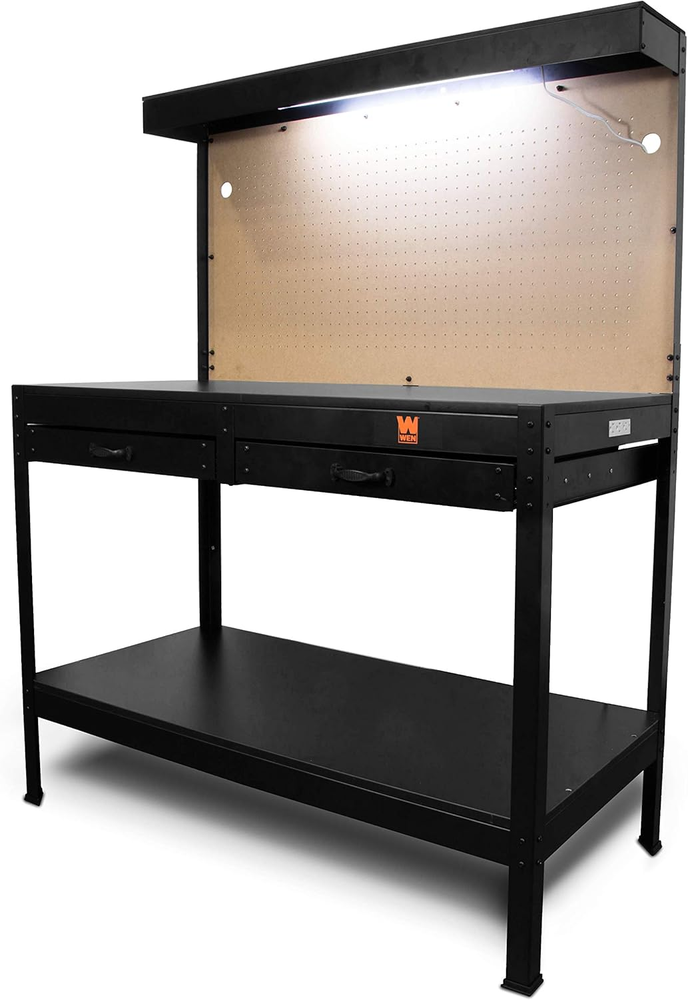
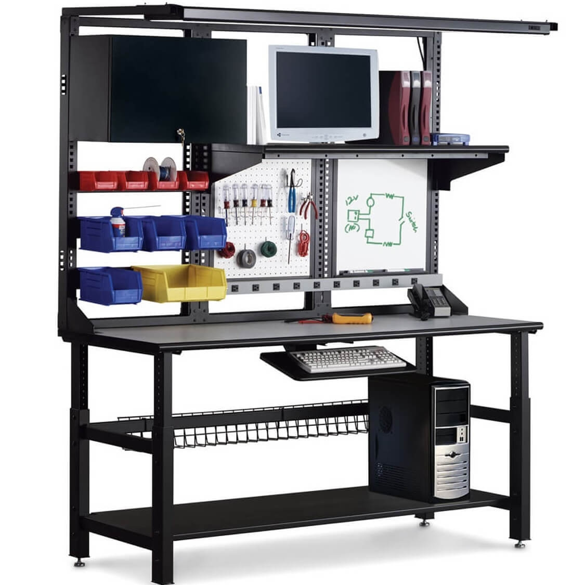
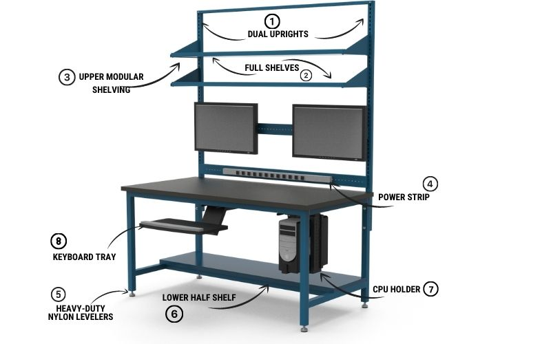

# Frankie's Corner

A corner of the study turned into a clean, flexible workbench for nerdy fun: electronics, Arduino, Raspberry Pi, plus LEGO / K'NEX / puzzles, or any other kind of crafting/building project. Not a traditional computer desk. The surface stays clear and open at all times. The monitor lives off the surface (wall or floating mount), and parts and tools get their own storage.

## What I'm actually trying to build

I struggled to find this online because I didn't know what to call it. The closest real-world terms are: **electronics workbench**, **maker desk**, **IT / LAN workstation**, **tech workstation**, or **computer workbench**. Everything I found that nailed all my requirements was either aimed at businesses or absurdly expensive (one custom worktable was over $5,000). Building it from scratch isn't an option (I don't know how, and we need to get something soon because that corner is sad). So the goal is to **assemble** the right setup from cheap, off-the-shelf parts rather than build or buy a single fancy unit.

## The space

- Corner wall is **75"** wide on paper.
- But when the **closet door swings open** the usable width drops to about **60"**.
- The futon that used to be here is gone, so I have more room than the old plan assumed (the old doc capped me at 47").
- **Working constraint: the desk must clear the closet door. Aim for ~48", up to ~55" max** if the door still opens freely. Don't fill the whole 60".

## Requirements

Must have:

- Completely clean, open work surface (nothing permanently on it, no PC sitting on top)
- Correct height to sit at with a normal desk chair (fixed sit-down height; no standing desk needed)
- Room for legs underneath
- Monitor that is **wall-mounted or floating**, NOT sitting on the surface
- Storage for small parts / pieces
- A place to keep tools
- Power strip or outlets, ideally across the back

Nice to have:

- Lighting above the work surface
- Room underneath for a PC or storage (on a shelf or the floor, not on the desktop)

## The plan: cheapest, fastest way to do this

The trick is to stop looking for one perfect product. Buy a plain, sturdy desk now for the clean surface, then bolt on the monitor, storage, power, and light as cheap add-ons over time. Do it in phases so you're not blocked on decisions you don't need to make yet.

### Phase 1 - Get the surface (this is what to buy now)

This is the only thing we need to order right now. **A simple, fixed-height rectangular desk, about 48" wide** (up to ~55" only if the closet door still clears it), with an open top and room for legs underneath. No hutch, no built-in shelves crowding the surface, no pegboard. Plain table-style desks like this run roughly $80-150 at Amazon, Home Depot, Wayfair, or IKEA. That's it for now. Everything below can wait and gets added to the existing desk.

### Phase 2 - Get the monitor off the surface

A monitor that mounts to the wall behind the desk (a VESA wall mount) or a clamp-on monitor arm that grabs the back edge of the desk. Either one frees up the entire surface. Wall mount is cheapest and keeps the desk totally clear; an arm is easier to reposition. ~$25-60.

### Phase 3 - Storage for tools and parts

- A small **rolling drawer cart** that tucks under or beside the desk for tools. ~$40-80.
- **Stackable small-parts bins / organizers** for components, LEGO, K'NEX, etc. ~$15-40.

### Phase 4 - Power and light

- A **power strip mounted to the back** of the desk (mounting tape or screws) so cords stay off the surface. ~$15-25.
- A **clamp-on LED light** or under-shelf light bar above the work area. ~$20-40.

## Why this works

Phase 1 alone gets me a usable clean surface immediately for the price of a basic desk. Each later phase is an independent, cheap upgrade I can add whenever, without rebuilding anything. Total stays well under the cost of any pre-made "workbench," and there's nothing to assemble beyond flat-pack furniture.

## Notes / reference (from the original write-up)

Old options I'd considered, kept here for reference:

- [**WEN WB4723T 48" Workbench**](https://www.amazon.com/WEN-WB4723T-48-Inch-Workbench-Outlets/dp/B08ZW1KYZN/) with power outlets and light (~$150-200) - nice, but no leg room, unsure of height, and the big pegboard is overkill.

- [**Craftsman Mobile Worktable**](https://www.cubicles.com/shop/industrial-workbench/workbench-with-storage/craftsman-mobile-worktable) - exactly the right spirit (power strip, tool/parts storage, fits a PC) but over $5,000.

- **Custom IT/LAN workbenches** - right idea (bottom shelf with leg room, mounted monitors, clear surface, power strip) but built for businesses and expensive.

- Helpful search keywords: LAN workstation, IT table, computer workbench, computer table, LAN table, tech workstation, computer desk, IT desk, LAN station.
- DIY references (if I ever change my mind on building): "Ultimate Electronics Station Build" (~$300) and "How to Build a Cable-Free Desk with Built-In Lights, USB, Outlets + More."

_Tools and parts (soldering iron, components, etc.) are a separate, later decision. This plan covers the furniture only._
